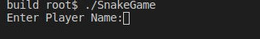
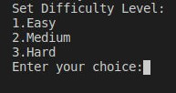
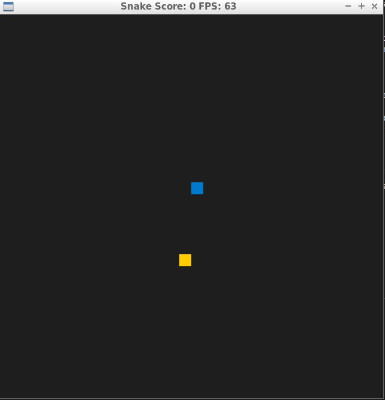
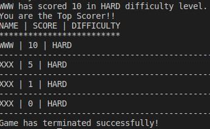

# CPPND: Capstone Snake Game Example

This is a starter repo for the Capstone project in the [Udacity C++ Nanodegree Program](https://www.udacity.com/course/c-plus-plus-nanodegree--nd213). The code for this repo was inspired by [this](https://codereview.stackexchange.com/questions/212296/snake-game-in-c-with-sdl) excellent StackOverflow post and set of responses.

The Capstone Project gives you a chance to integrate what you've learned throughout this program. This project will become an important part of your portfolio to share with current and future colleagues and employers.

In this project, you can build your own C++ application or extend this Snake game, following the principles you have learned throughout this Nanodegree Program. This project will demonstrate that you can independently create applications using a wide range of C++ features.

## Snake Game Overview
The code has been divided into 5 distinct class based components:

1. Game class has the functions responsible for maintaining the game board and the placement of game elements like the snake and the food
2. Renderer class  has the functions to render the state of the game using the SDL library
3. Snake class has the functions to construct and maintain the snake object as it moves across the board
4. Controller class has the functions to recieve input from the user in order to control the movement of the snake
5. PlayerInfo class has the functions to maintain the history of the score sheet

Upon launching the game, the player is requested first requested to enter the name of the player.

After that the player is requested to set the difficulty level. The difficulty levels controls the speed of the snake. There are three difficulty levels, 

* EASY: The speed doesn't change with each food being eaten by the snake
* MEDIUM: The speed increases at a constant rate
* HARD: The speed increases at a rate twice as high as the rate for MEDIUM

By this point, the game has already fetched the exsting scores from the file ScoreSheet.txt and stores to a private vector data member available in the PlayerInfo class
The game then launches after the user sets the difficulty level and the player is able to play the game

Once the player exits the game, the private vector data member which has the previous scores is updated with the current player's scores. It is then sorted in the descending order and written back to the ScoreSheet.txt. Before the writing a check is made if the the score of the current player is greater than the maximum score on the score sheet. If this check is passed then the player is congratulated for being the top scorer.

## Rubics Items Matched
+ **Loops, Functions, I/O**  
>*The project demonstrates an understanding of C++ functions and control structures: A variety of control structures are used in the project. The project code is clearly organized into functions.*

Different sections of the code are organized into functions. An example for this would be member functions of the class cPlayerInfo, found in *playerinfo.h* and their corresponding definitions in *playerinfo.cpp*

+ **Loops, Functions, I/O** 
>*The project reads data from a file and process the data, or the program writes data to a file: The project reads data from an external file or writes data to a file as part of the necessary operation of the program.* : 

The class cPlayerInfo has two private functions *ReadPlayerScoreHistory()* (in *playerinfo.cpp*, line 29 - 43) and *WritePlayerScoreHistory()* (in *playerinfo.cpp*, line 129 - 140). *ReadPlayerScoreHistory()* is used to read the file ScoreSheet.txt and store name, score and difficulty to the vector _table. *WritePlayerScoreHistory()* is used to write the name, score and difficulty to the file ScoreSheet.txt from the vector _table

+ **Loops, Functions, I/O**
>*The project accepts user input and processes the input: The project accepts input from a user as part of the necessary operation of the program.* : 

Upon launching the game, the player is requested first requested to enter the name of the player. After that the player is asked to set the difficulty level. The Player name is accepted in the constructor of the class cPlayerInfo (in *playerinfo.cpp* line 19). The difficulty level is accepted in the constructor of the class Game. in the file *game.cpp* at line 8 is the function call *checkForLevels()*. This function checks if the player makes a valid entry by means of try and catch

+ **Object Oriented Programming**
>*The project uses Object Oriented Programming techniques: The project code is organized into classes with class attributes to hold the data, and class methods to perform tasks.: All class data members are explicitly specified as public, protected, or private.*

The code has been divided into 5 distinct class based components:
  
    1. Game class (*game.h*) has the functions responsible for maintaining the game board and the placement of game elements like the snake and the food
    2. Renderer class (*renderer.h*)  has the functions to render the state of the game using the SDL library
    3. Snake class (*snake.h*) has the functions to construct and maintain the snake object as it moves across the board
    4. Controller class (*controller.h*) has the functions to receive input from the user in order to control the movement of the snake
    5. cPlayerInfo class (*playerinfo.h*) has the functions to maintain the history of the score sheet

Each class has its own private and public members

+ **Object Oriented Programming**
>*Class constructors utilize member initialization lists: All class members that are set to argument values are initialized through member initialization lists.*

The constructors of class cPlayerInfo (in playerinfo.cpp, line 16) and Game (in game.cpp line 6) use initialization lists

+ **Object Oriented Programming**
>*Classes abstract implementation details from their interfaces.: All class member functions document their effects, either through function names, comments, or formal documentation. Member functions do not change program state in undocumented ways.*

The member functions have been commented with a description , return type and arguments required(see *playerinfo.cpp*)

+ **Object Oriented Programming**
>*Classes encapsulate behaviour.:Appropriate data and functions are grouped into classes. Member data that is subject to an invariant is hidden from the user. State is accessed via member functions.*

Grouping of data and functions have been performed on all 5 classes available

## Dependencies for Running Locally
* cmake >= 3.7
  * All OSes: [click here for installation instructions](https://cmake.org/install/)
* make >= 4.1 (Linux, Mac), 3.81 (Windows)
  * Linux: make is installed by default on most Linux distros
  * Mac: [install Xcode command line tools to get make](https://developer.apple.com/xcode/features/)
  * Windows: [Click here for installation instructions](http://gnuwin32.sourceforge.net/packages/make.htm)
* SDL2 >= 2.0
  * All installation instructions can be found [here](https://wiki.libsdl.org/Installation)
  >Note that for Linux, an `apt` or `apt-get` installation is preferred to building from source. 
* gcc/g++ >= 5.4
  * Linux: gcc / g++ is installed by default on most Linux distros
  * Mac: same deal as make - [install Xcode command line tools](https://developer.apple.com/xcode/features/)
  * Windows: recommend using [MinGW](http://www.mingw.org/)

## Basic Build Instructions

1. Clone this repo.
2. Make a build directory in the top level directory: `mkdir build && cd build`
3. Compile: `cmake .. && make`
4. Run it: `./SnakeGame`.

## CC Attribution-ShareAlike 4.0 International

Shield: [![CC BY-SA 4.0][cc-by-sa-shield]][cc-by-sa]

This work is licensed under a
[Creative Commons Attribution-ShareAlike 4.0 International License][cc-by-sa].

[![CC BY-SA 4.0][cc-by-sa-image]][cc-by-sa]

[cc-by-sa]: http://creativecommons.org/licenses/by-sa/4.0/
[cc-by-sa-image]: https://licensebuttons.net/l/by-sa/4.0/88x31.png
[cc-by-sa-shield]: https://img.shields.io/badge/License-CC%20BY--SA%204.0-lightgrey.svg

